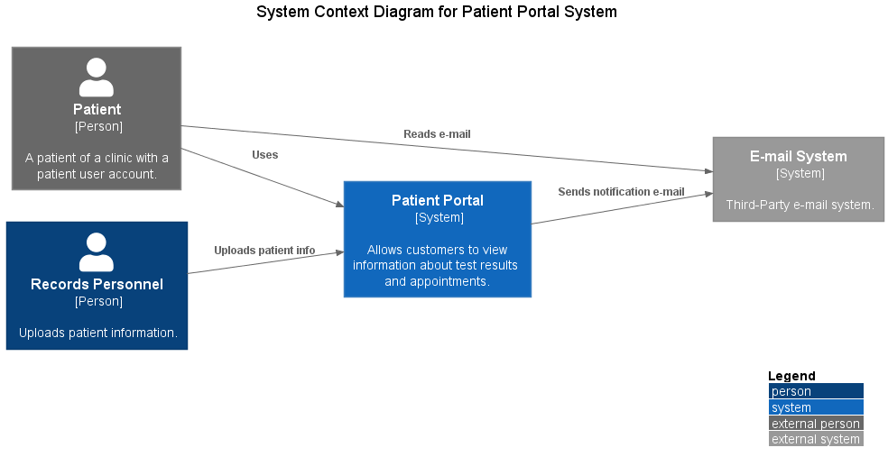

# C4 Plant UML Diagram
C4 plant Unified Modeling Language (UML) for application visualizaton and threat-modeling.

### Context Template

### Container Template

### Component Template

### References
- Plant UML - https://github.com/plantuml-stdlib/C4-PlantUML
- C4 Diagram - https://c4model.com/
